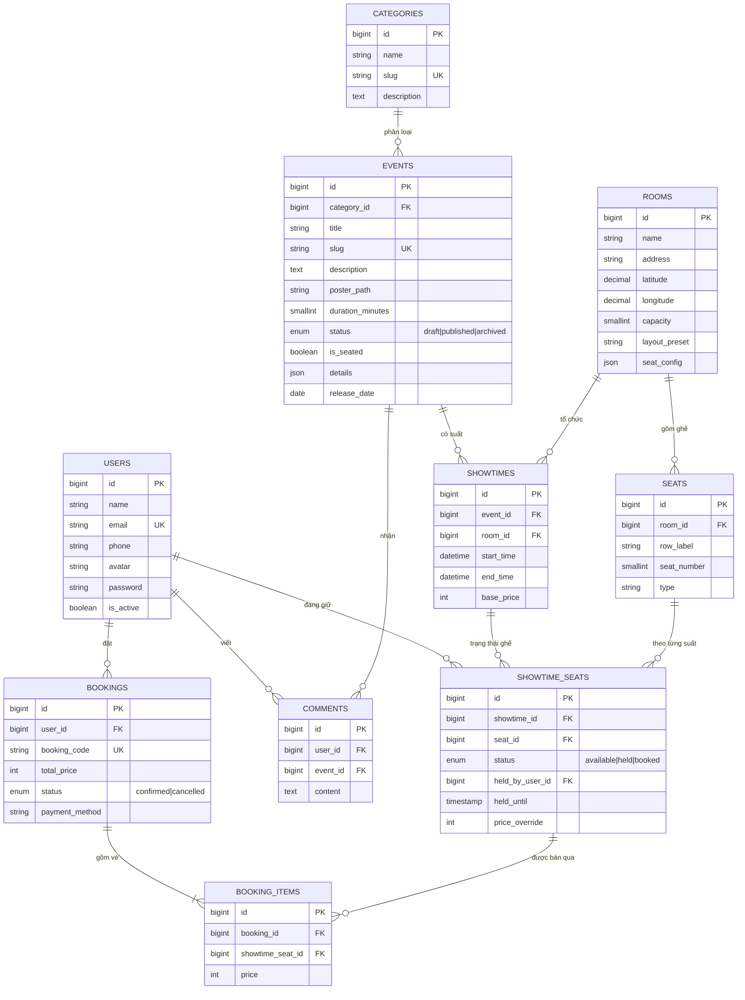
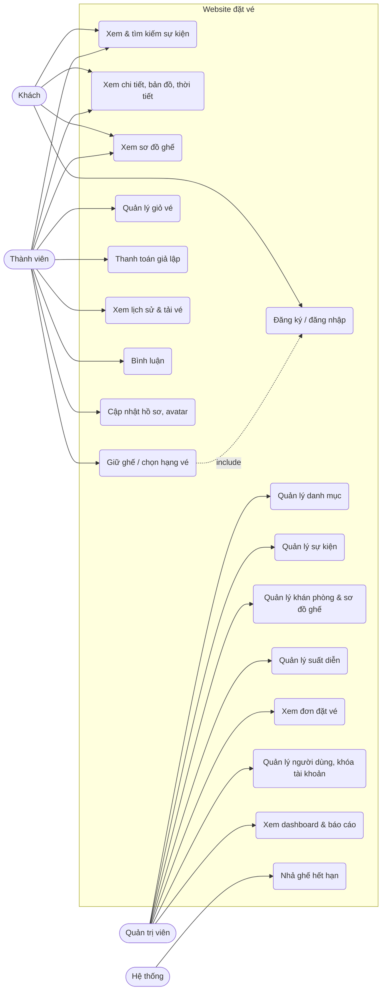

# Plan 6 — Báo cáo, README, kịch bản thuyết trình

> **For agentic workers:** REQUIRED SUB-SKILL: Use superpowers:subagent-driven-development (recommended) or superpowers:executing-plans to implement this plan task-by-task. Steps use checkbox (`- [ ]`) syntax for tracking.

**Goal:** Đủ tài liệu cho tiêu chí "Báo cáo & thuyết trình" (10%): ERD, use case, mô tả chức
năng bám rubric, checklist ảnh chụp màn hình, README cài đặt chạy được từ máy trắng, kịch bản demo.

**Architecture:** Tài liệu Markdown trong `docs/report/`, sơ đồ viết bằng Mermaid (GitHub và
VS Code hiển thị trực tiếp, xuất ảnh bằng https://mermaid.live nếu cần chèn vào Word). Mọi mô
tả phải khớp code thật trên `main` — mỗi mục chức năng ghi đường dẫn file để người chấm kiểm tra.

**Tech Stack:** Markdown, Mermaid.

**Spec:** `docs/superpowers/specs/2026-09-07-ticket-booking-platform-design.md` (mục 1 rubric, mục 7 `docs/report/`, Phase 6)
**Lộ trình:** `docs/superpowers/plans/2026-09-21-roadmap-hoan-thien.md`

## Global Constraints

- Nhánh: `feature/report-docs`, rẽ từ `main` **sau khi Plan 1–5 đã merge**.
- Viết tiếng Việt. Không bịa tính năng: trước khi viết mỗi mục, mở file code được dẫn để xác nhận.
- Không sửa code ứng dụng trong plan này (trừ README).
- Ảnh chụp màn hình do thành viên chụp tay theo checklist; plan chỉ tạo thư mục + checklist.

## File Structure

| File | Nội dung |
|---|---|
| `docs/report/erd.md` | ERD Mermaid + giải thích từng bảng |
| `docs/report/use-cases.md` | Tác nhân, sơ đồ use case, bảng đặc tả use case chính |
| `docs/report/chuc-nang.md` | Mô tả chức năng theo 5 tiêu chí rubric, kèm file code |
| `docs/report/anh-chup.md` + `docs/report/screenshots/.gitkeep` | Checklist ảnh cần chụp |
| `docs/report/kich-ban-demo.md` | Kịch bản thuyết trình + demo chống đặt trùng |
| `README.md` | Thay README mặc định của Laravel |

---

### Task 1: ERD

**Files:**
- Create: `docs/report/erd.md`

- [ ] **Step 1: Đối chiếu schema thật**

Run: `php artisan migrate:fresh --seed && php artisan db:show --counts` và `php artisan db:table events`
(lặp lại cho `rooms`, `seats`, `showtimes`, `showtime_seats`, `bookings`, `booking_items`, `comments`, `users`).
Nếu cột nào khác với sơ đồ dưới → sửa sơ đồ cho khớp DB thật.

- [ ] **Step 2: Tạo `docs/report/erd.md`**

````markdown
# Sơ đồ quan hệ thực thể (ERD)



Bảng phân quyền `roles`, `permissions`, `model_has_roles`… do `spatie/laravel-permission` tạo, không vẽ ở đây.

## Giải thích thiết kế

| Bảng | Vai trò | Ràng buộc đáng chú ý |
|---|---|---|
| `events` | Sự kiện (concert, hòa nhạc, hội thảo…) | `details` JSON chứa địa điểm, lineup, lịch trình, BTC, quy định; `is_seated` = chọn ghế trên sơ đồ hay mua theo hạng |
| `rooms` / `seats` | Khán phòng và ghế vật lý | `unique(room_id, row_label, seat_number)`; `type` quyết định hạng giá |
| `showtimes` | Suất diễn của 1 sự kiện tại 1 khán phòng | Không cho 2 suất chồng giờ cùng phòng (kiểm ở `ShowtimeRequest`) |
| `showtime_seats` | Trạng thái từng ghế trong từng suất — **đồng thời là giỏ hàng** | `unique(showtime_id, seat_id)`; `held` + `held_by_user_id` + `held_until` = ghế trong giỏ |
| `bookings` / `booking_items` | Đơn đặt vé và từng vé | `booking_code` duy nhất; `price` chốt tại lúc giữ ghế |
| `comments` | Bình luận sự kiện | Chỉ chủ bình luận hoặc admin được xóa |

**Vì sao không có bảng `cart_items`?** Một ghế đang được giữ đã chứa đủ thông tin "ai giữ, tới khi nào, giá bao nhiêu".
Thêm bảng giỏ hàng sẽ tạo 2 nguồn sự thật có thể lệch nhau.

**Chống đặt trùng ghế:** `SeatHoldService` khóa các dòng `showtime_seats` bằng `SELECT … FOR UPDATE` trong transaction,
chỉ đổi sang `held` nếu ghế đang trống (hoặc giữ đã quá hạn). Hai người bấm cùng lúc: người sau phải chờ khóa, đọc lại thấy ghế đã `held` → nhận lỗi.
````

- [ ] **Step 3: Kiểm tra Mermaid hiển thị**

Mở file trong VS Code (Markdown Preview có Mermaid) hoặc dán khối vào https://mermaid.live — sơ đồ phải vẽ được, không lỗi cú pháp.

- [ ] **Step 4: Commit**

```bash
git add docs/report/erd.md
git commit -m "docs: add ERD for the report"
```

---

### Task 2: Use case

**Files:**
- Create: `docs/report/use-cases.md`

- [ ] **Step 1: Tạo `docs/report/use-cases.md`**

````markdown
# Use Case

## Tác nhân

| Tác nhân | Mô tả |
|---|---|
| Khách (chưa đăng nhập) | Xem, tìm kiếm sự kiện, xem sơ đồ ghế |
| Thành viên (`user`) | Mọi quyền của Khách + giữ ghế, thanh toán, xem lịch sử, bình luận, sửa hồ sơ |
| Quản trị viên (`admin`) | Quản lý danh mục, sự kiện, khán phòng, suất diễn, đơn đặt vé, người dùng; xem thống kê |
| Hệ thống (lịch chạy mỗi phút) | Nhả ghế giữ quá hạn |

## Sơ đồ



## Đặc tả use case chính

### UC5 — Giữ ghế
- **Tác nhân:** Thành viên
- **Tiền điều kiện:** Đã đăng nhập, tài khoản không bị khóa, suất diễn chưa bắt đầu, sự kiện đang mở bán.
- **Luồng chính:**
  1. Thành viên mở sơ đồ ghế của một suất, chọn tối đa 8 chỗ (hoặc chọn hạng vé + số lượng với sự kiện không chọn ghế).
  2. Bấm "Xác Nhận Giữ Chỗ" → trình duyệt gửi AJAX `POST /showtimes/{id}/holds`.
  3. Hệ thống khóa các ghế, kiểm tra còn trống, chuyển sang "đang giữ" 10 phút, chốt giá.
  4. Chuyển tới giỏ vé với đồng hồ đếm ngược.
- **Luồng thay thế:**
  - 2a. Chưa đăng nhập → chuyển tới trang đăng nhập.
  - 3a. Có ghế vừa bị người khác giữ/bán → báo "Ghế … vừa có người giữ", không giữ ghế nào (tất cả hoặc không).
  - 3b. Hạng vé không đủ chỗ → báo "Hạng vé … chỉ còn N chỗ".
- **Hậu điều kiện:** Ghế ở trạng thái `held` của thành viên; nếu không thanh toán trong 10 phút, ghế tự trống lại.

### UC7 — Thanh toán giả lập
- **Tác nhân:** Thành viên
- **Tiền điều kiện:** Giỏ vé có ghế còn hạn giữ.
- **Luồng chính:** chọn phương thức (VietQR / MoMo / ZaloPay / Thẻ) → bấm xác nhận → hệ thống tạo đơn `confirmed`, mã `TBX-XXXXXXXX`, ghế chuyển `booked` → hiện vé điện tử.
- **Luồng thay thế:** giỏ trống hoặc hết hạn → báo lỗi, không tạo đơn.

### UC14 — Quản lý suất diễn
- **Tác nhân:** Quản trị viên
- **Luồng chính:** chọn sự kiện, khán phòng, giờ bắt đầu/kết thúc, giá cơ bản → hệ thống kiểm tra không chồng giờ → tạo suất và sinh trạng thái cho từng ghế.
- **Ràng buộc:** không xóa/đổi phòng suất đã bán vé.

(Viết thêm theo cùng mẫu cho UC1, UC9, UC12, UC13, UC16.)
````

Sau đó **viết thật** 5 mục đặc tả còn lại (UC1, UC9, UC12, UC13, UC16) theo đúng mẫu 4 dòng (Tác nhân / Tiền điều kiện / Luồng chính / Luồng thay thế), dựa trên code:
UC1 `app/Http/Controllers/EventController.php` + `SearchSuggestionController.php`; UC9 `CommentController.php` + `CommentPolicy.php`;
UC12 `Admin/EventController.php` + `Requests/Admin/EventRequest.php`; UC13 `Admin/RoomController.php` + `Services/RoomSeatGenerator.php`;
UC16 `Admin/UserController.php` + `Middleware/EnsureUserIsActive.php`. Xóa dòng "(Viết thêm theo cùng mẫu …)" khi xong.

- [ ] **Step 2: Commit**

```bash
git add docs/report/use-cases.md
git commit -m "docs: add use case diagram and specifications"
```

---

### Task 3: Mô tả chức năng theo rubric

**Files:**
- Create: `docs/report/chuc-nang.md`

- [ ] **Step 1: Tạo `docs/report/chuc-nang.md`** với đúng 5 phần dưới, mỗi dòng bảng phải có đường dẫn file có thật (kiểm tra bằng `ls`):

````markdown
# Mô tả chức năng (đối chiếu tiêu chí chấm)

## 1. Hoàn thiện chức năng chính (40%)

| Yêu cầu | Đã làm | Code |
|---|---|---|
| CRUD | Danh mục, sự kiện (kèm upload poster), khán phòng (tự sinh sơ đồ ghế), suất diễn | `app/Http/Controllers/Admin/{Category,Event,Room,Showtime}Controller.php` |
| Auth | Đăng ký, đăng nhập, quên mật khẩu (Breeze); khóa tài khoản có hiệu lực ngay | `routes/auth.php`, `app/Http/Middleware/EnsureUserIsActive.php` |
| Validation | Form Request cho mọi form, thông báo tiếng Việt; chặn suất chồng giờ | `app/Http/Requests/**` |
| Pagination | Danh sách sự kiện public (9/trang), mọi bảng admin (10/trang) | `EventController@index`, `Admin/*Controller@index` |
| Search | Tìm theo tên/mô tả + lọc danh mục; gợi ý tìm kiếm tức thì | `EventController@index`, `SearchSuggestionController.php` |
| Đặt vé | Giữ ghế, giỏ vé, thanh toán giả lập, lịch sử, vé điện tử PNG | `app/Services/{SeatHoldService,CheckoutService}.php` |

## 2. Áp dụng công nghệ Laravel (25%)

| Công nghệ | Cách dùng | Code |
|---|---|---|
| Eloquent ORM | Quan hệ 1-n giữa 10 model, scope (`published`, `holdable`, `heldBy`), accessor (`poster_url`, `base_price`, chi tiết JSON), cast JSON/boolean/datetime | `app/Models/*` |
| Migration | 15+ migration, khóa ngoại, unique kép, index `(status, held_until)` | `database/migrations/*` |
| Seeder / Factory | Dữ liệu demo 8 sự kiện, 4 khán phòng; factory cho test | `database/seeders/*`, `database/factories/*` |
| Blade | Layout, component (`x-seat-map`, `x-event-card`, `x-admin.field`) | `resources/views/**` |
| Middleware | `auth`, `role:admin` (spatie), `throttle`, `EnsureUserIsActive` | `routes/web.php`, `bootstrap/app.php` |
| Policy | Quyền xóa bình luận | `app/Policies/CommentPolicy.php` |
| Transaction + Lock | Chống đặt trùng ghế | `app/Services/SeatHoldService.php` |
| Scheduler + Artisan command | Nhả ghế hết hạn mỗi phút | `app/Console/Commands/ReleaseExpiredSeatHolds.php`, `routes/console.php` |
| Storage | Poster, avatar trên disk `public` | `Admin/EventController.php`, `ProfileController.php` |
| HTTP Client + Cache | Gọi OpenWeatherMap, cache 30 phút | `app/Services/WeatherService.php` |
| Pest | <N> test / <M> assertion (điền từ `php artisan test`) | `tests/**` |

## 3. Thiết kế & trải nghiệm (15%)
Mô tả bảng màu (lấy từ `docs/architecture.md` mục 3), responsive (thử 375px / 768px / 1440px), sơ đồ sân vận động tương tác (zoom, lọc khu, xem thông tin ghế), đồng hồ giữ vé, thông báo toast. Dẫn ảnh trong `docs/report/screenshots/`.

## 4. Báo cáo & thuyết trình (10%)
Liệt kê: `erd.md`, `use-cases.md`, file này, `anh-chup.md`, `kich-ban-demo.md`.

## 5. Sáng tạo & mở rộng (10%)

| Tính năng | Code |
|---|---|
| AJAX giữ ghế + polling trạng thái ghế 15 giây | `resources/js/app.js` (`seatBookingManager`) |
| AJAX bình luận, gợi ý tìm kiếm, bỏ vé khỏi giỏ, khóa user | `resources/js/app.js` |
| Google Maps nhúng + OpenWeatherMap | `app/Support/MapEmbed.php`, `app/Services/WeatherService.php` |
| Thiết kế sơ đồ khán phòng theo preset | `app/Services/RoomSeatGenerator.php`, `resources/views/admin/rooms/builder.blade.php` |
| Dashboard doanh thu, báo cáo in PDF | `Admin/DashboardController.php`, `Admin/ReportController.php` |
| Trợ lý chatbot (FAQ) | `resources/views/components/ai-chatbot.blade.php` |
````

Điền `<N>` và `<M>` bằng số thật từ output `php artisan test`.

- [ ] **Step 2: Commit**

```bash
git add docs/report/chuc-nang.md
git commit -m "docs: map implemented features to the grading rubric"
```

---

### Task 4: Checklist ảnh chụp + kịch bản demo

**Files:**
- Create: `docs/report/anh-chup.md`, `docs/report/screenshots/.gitkeep`, `docs/report/kich-ban-demo.md`

- [ ] **Step 1: `docs/report/anh-chup.md`**

```markdown
# Checklist ảnh chụp màn hình

Chuẩn bị: `php artisan migrate:fresh --seed`, `php artisan serve --port=8080`. Lưu ảnh PNG vào `docs/report/screenshots/` đúng tên dưới đây. Chụp cả bản desktop (1440px) và mobile (375px, DevTools) cho mục có dấu (M).

| # | Tên file | Trang / thao tác | Tài khoản |
|---|---|---|---|
| 1 | `01-trang-chu.png` (M) | `/` | Khách |
| 2 | `02-danh-sach-tim-kiem.png` | `/events?q=concert` | Khách |
| 3 | `03-goi-y-tim-kiem.png` | Mở ô tìm kiếm, gõ "hòa" | Khách |
| 4 | `04-chi-tiet-su-kien.png` | Trang concert Anh Trai (có bản đồ + thời tiết) | Khách |
| 5 | `05-so-do-san-van-dong.png` | Sơ đồ ghế suất concert, đang chọn 3 ghế | user@ticketbox.vn |
| 6 | `06-so-do-nha-hat.png` | Sơ đồ ghế suất hòa nhạc | user@ticketbox.vn |
| 7 | `07-chon-hang-ve.png` | Suất hội thảo, chọn Combo 2 người | user@ticketbox.vn |
| 8 | `08-bao-ghe-da-giu.png` | Cửa sổ thứ 2 cố giữ ghế người khác đang giữ | lethutrang@gmail.com |
| 9 | `09-gio-ve.png` (M) | `/cart` có đồng hồ đếm ngược | user@ticketbox.vn |
| 10 | `10-thanh-toan-qr.png` | Bước thanh toán VietQR | user@ticketbox.vn |
| 11 | `11-ve-dien-tu.png` | Màn hình E-Ticket sau thanh toán | user@ticketbox.vn |
| 12 | `12-lich-su.png` | `/bookings` | user@ticketbox.vn |
| 13 | `13-binh-luan.png` | Gửi bình luận không tải lại trang | user@ticketbox.vn |
| 14 | `14-admin-dashboard.png` | `/admin` | admin@ticketbox.vn |
| 15 | `15-admin-su-kien-form.png` | Form thêm/sửa sự kiện | admin@ticketbox.vn |
| 16 | `16-admin-suat-dien.png` | Danh sách suất diễn + form | admin@ticketbox.vn |
| 17 | `17-admin-khan-phong.png` | Trình thiết kế khán phòng | admin@ticketbox.vn |
| 18 | `18-admin-don-dat-ve.png` | `/admin/bookings` | admin@ticketbox.vn |
| 19 | `19-admin-nguoi-dung.png` | `/admin/users`, đang khóa 1 tài khoản | admin@ticketbox.vn |
| 20 | `20-validation.png` | Form sự kiện bỏ trống → thông báo lỗi tiếng Việt | admin@ticketbox.vn |
| 21 | `21-test-pass.png` | Terminal `php artisan test` toàn xanh | — |
```

Tạo file rỗng `docs/report/screenshots/.gitkeep`.

- [ ] **Step 2: `docs/report/kich-ban-demo.md`**

```markdown
# Kịch bản thuyết trình (~10 phút)

## Chuẩn bị trước giờ trình bày
1. `php artisan migrate:fresh --seed` (dữ liệu sạch, suất diễn tính từ ngày hôm nay).
2. `npm run build`, `php artisan serve --port=8080`, `php artisan schedule:work` (cửa sổ riêng).
3. Mở sẵn 2 trình duyệt: Chrome (user@ticketbox.vn), Chrome ẩn danh (lethutrang@gmail.com). Mật khẩu `password`.
4. Kiểm tra `.env` có `OPENWEATHER_API_KEY` (nếu không có, khối thời tiết hiện "Chưa có dự báo" — vẫn demo được).

## Trình tự
| Phút | Người nói | Nội dung |
|---|---|---|
| 0–1 | … | Giới thiệu đề tài, công nghệ (Laravel 11, MySQL, Tailwind + Alpine, Pest) |
| 1–2 | … | ERD (`erd.md`): vì sao `showtime_seats` là giỏ hàng |
| 2–4 | … | Luồng khách: tìm kiếm có gợi ý → chi tiết (bản đồ, thời tiết) → sơ đồ ghế |
| 4–6 | … | **Demo chống đặt trùng:** cả 2 trình duyệt mở cùng suất concert; trình duyệt 1 giữ ghế SVIP-A5; trình duyệt 2 bấm SVIP-A5 → sau ≤15 giây bị báo "vừa có người giữ"; giải thích `lockForUpdate` |
| 6–7 | … | Giỏ vé, đồng hồ 10 phút, bỏ 1 vé, thanh toán MoMo → E-Ticket → lịch sử |
| 7–9 | … | Admin: tạo sự kiện có poster → tạo suất (thử trùng giờ để thấy lỗi) → thấy đơn vừa đặt + doanh thu dashboard → khóa 1 user (user đó bị đăng xuất ngay) |
| 9–10 | … | Chạy `php artisan test`, tổng kết theo `chuc-nang.md` |

## Câu hỏi hay gặp
- *Hai người bấm cùng một ghế cùng lúc thì sao?* — Transaction + `SELECT … FOR UPDATE`: request sau chờ request trước xong, đọc lại thấy ghế đã `held` nên bị từ chối. Xem `SeatHoldService::hold()`.
- *Không thanh toán thì ghế bị giữ mãi?* — Không. Giữ 10 phút; quá hạn ghế được coi là trống ngay, lệnh `seats:release-expired` dọn dữ liệu mỗi phút.
- *Sao không có bảng giỏ hàng?* — Xem `erd.md` mục "Vì sao không có bảng cart_items".
- *Thanh toán có thật không?* — Giả lập theo phạm vi đề tài (spec mục 5); đơn vẫn được tạo thật trong DB.
```

Điền tên người nói vào cột "Người nói" sau khi nhóm phân công (để `…` nếu chưa có).

- [ ] **Step 3: Commit**

```bash
git add docs/report/anh-chup.md docs/report/screenshots/.gitkeep docs/report/kich-ban-demo.md
git commit -m "docs: add screenshot checklist and demo script"
```

---

### Task 5: README mới

**Files:**
- Modify: `README.md` (thay toàn bộ nội dung mặc định của Laravel)

- [ ] **Step 1: Viết `README.md`**

````markdown
# TicketBox — Website quản lý đặt vé sự kiện

Đồ án môn Mã nguồn mở. Laravel 11 · PHP 8.3 · MySQL 8.4 · Tailwind CSS + Alpine.js · Pest.

## Tính năng chính
- Khách: tìm kiếm/lọc sự kiện, gợi ý tìm kiếm tức thì, chi tiết sự kiện có bản đồ và dự báo thời tiết, sơ đồ ghế tương tác.
- Thành viên: giữ ghế 10 phút (chống đặt trùng), giỏ vé, thanh toán giả lập (VietQR/MoMo/ZaloPay/Thẻ), vé điện tử, lịch sử, bình luận, hồ sơ + avatar.
- Quản trị: danh mục, sự kiện (upload poster), khán phòng (tự sinh sơ đồ ghế), suất diễn, đơn đặt vé, người dùng (khóa/mở), dashboard, báo cáo.

## Cài đặt (Windows + Laragon)
```bash
git clone git@github.com:whatthefoxsay-nhp/course-project-of-MaNguonMo.git DoAnMNM
cd DoAnMNM
composer install --no-security-blocking
npm install
cp .env.example .env
php artisan key:generate
```
Sửa `.env`: `DB_DATABASE=doanmnm_ticket`, `DB_USERNAME=root`, `DB_PASSWORD=` (tạo database `doanmnm_ticket` trong Laragon/HeidiSQL trước).

```bash
php artisan migrate --seed
php artisan storage:link
npm run build
php artisan serve --port=8080
```
Mở http://127.0.0.1:8080

Tùy chọn: chạy `php artisan schedule:work` ở cửa sổ khác để dọn ghế giữ quá hạn mỗi phút.

## Khóa API (tùy chọn)
- `OPENWEATHER_API_KEY` — dự báo thời tiết trên trang sự kiện (đăng ký miễn phí tại openweathermap.org).
- `GOOGLE_MAPS_EMBED_KEY` — bản đồ qua Maps Embed API; bỏ trống vẫn hiện bản đồ bằng link nhúng công khai.

Sau khi sửa `.env`: `php artisan config:clear`.

## Tài khoản demo (mật khẩu `password`)
| Vai trò | Email |
|---|---|
| Quản trị | admin@ticketbox.vn |
| Thành viên | user@ticketbox.vn |
| Thành viên | lethutrang@gmail.com |
| Bị khóa (để thử) | trandinhkhoi@gmail.com |

## Kiểm thử
```bash
php artisan test
```

## Tài liệu
- Đặc tả: `docs/superpowers/specs/2026-09-07-ticket-booking-platform-design.md`
- Kiến trúc & quyết định: `docs/architecture.md`
- Báo cáo: `docs/report/` (ERD, use case, chức năng, ảnh chụp, kịch bản demo)

## Thành viên
| Họ tên | Vai trò |
|---|---|
| … | … |
````

Kiểm tra lại từng lệnh trong README chạy được (có thể thử trên một thư mục clone mới). Để bảng "Thành viên" với `…` — nhóm tự điền.

- [ ] **Step 2: Kiểm tra cuối + commit + PR**

```bash
php artisan test
grep -rn "DemoCatalog" app resources tests database routes   # phải rỗng
git add README.md
git commit -m "docs: replace default Laravel README with project guide"
git push -u origin feature/report-docs
gh pr create --base main --title "Plan 6: Báo cáo, README, kịch bản demo" --body "Theo docs/superpowers/plans/2026-09-21-p6-report-docs.md. Output php artisan test: <dán vào đây>"
```
